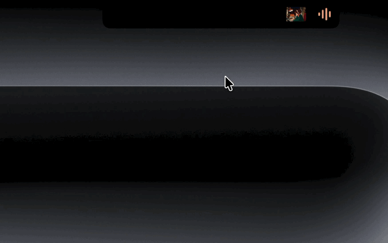

# Dynamic Island

**A Dynamic Island for your MacBook's notch.** Hover the notch and it expands
into a frosted-glass panel: media controls with album art, quick notes, a file
tray, your calendar, a webcam mirror, live system stats, and system toggles.
When music plays, the island grows an "ear" — album artwork and a live
equalizer tinted with the album's colors — right beside the notch.



## Why this one?

Dynamic Island does something the other notch apps don't: **it recognizes YouTube
playing in Chrome.** Video title, real thumbnail as artwork, play/pause/next
controls, and a volume slider that drives YouTube's own player volume —
independent of your Mac's output volume. Apple Music and Spotify get the same
treatment through their native interfaces, including per-app volume.

## Features

- **Dynamic Island** — album art + animated equalizer beside the notch,
  colored from the artwork. Hover the waves for mini transport controls
  without opening the panel. Click them to play/pause.
- **Media** — Apple Music, Spotify, and YouTube-in-Chrome. Apple-style
  mini-player: artwork, live progress with elapsed/remaining, transport,
  and per-player volume. Launch buttons start closed players and resume
  playback.
- **Notes** — three autosaving scratchpad pages, persisted to disk with a
  backup file.
- **Tray** — drag files onto the notch to shelve them; drag out to move,
  AirDrop one or all.
- **Calendar** — your next 7 days from the native macOS Calendar.
- **Mirror** — one-click webcam check before calls, with a zoom button.
- **Stats** — CPU, memory, GPU, disk, fan, battery as circular gauges with
  green/yellow/red severity colors.
- **Controls** — dark mode, keep-awake, hide desktop icons, scrubbable
  display & keyboard-backlight brightness, mute, lock screen, screenshot.

The panel is one fixed transparent window; the island animates inside it, so
transitions are pure springs with zero window-snapping. Clicks in the
transparent area pass through to whatever is beneath. Works on Macs without
a notch too (it draws its own).

## Install

Build from source (recommended — takes ~30 seconds):

```sh
git clone https://github.com/SensuBeans/dynamic-mac-island.git
cd dynamic-mac-island
./make-app.sh
open "Dynamic Island.app"
```

Requires macOS 13+ and Xcode Command Line Tools (`xcode-select --install`).

If you download a prebuilt release instead: it's not notarized, so
right-click → Open the first time, or
`xattr -dr com.apple.quarantine "Dynamic Island.app"`.

### Start at login

```sh
cat > ~/Library/LaunchAgents/com.sensubeans.notchbook.plist <<EOF
<?xml version="1.0" encoding="UTF-8"?>
<!DOCTYPE plist PUBLIC "-//Apple//DTD PLIST 1.0//EN" "http://www.apple.com/DTDs/PropertyList-1.0.dtd">
<plist version="1.0">
<dict>
    <key>Label</key><string>com.sensubeans.notchbook</string>
    <key>ProgramArguments</key>
    <array><string>/usr/bin/open</string><string>-a</string><string>$PWD/Dynamic Island.app</string></array>
    <key>RunAtLoad</key><true/>
    <key>ProcessType</key><string>Interactive</string>
</dict>
</plist>
EOF
launchctl bootstrap gui/$(id -u) ~/Library/LaunchAgents/com.sensubeans.notchbook.plist
```

## Permissions (each is a one-time prompt, on first use)

| Prompt | Triggered by | Needed for |
|---|---|---|
| Automation → Music / Spotify | Opening the media tab with the player running | Track info, artwork, controls, volume |
| Automation → Google Chrome | A YouTube tab being detected | Title/thumbnail detection |
| Chrome ▸ View ▸ Developer ▸ **Allow JavaScript from Apple Events** | Manual, in Chrome's menu bar | YouTube play/pause + volume (the media card reminds you until it's on) |
| Camera | Opening the Mirror tab | Webcam preview |
| Calendars | "Allow Access" in the Calendar tab | Upcoming events |
| Automation → System Events | Dark-mode toggle | Dark mode |

`make-app.sh` signs with a local certificate when one named "Notchbook
Signing" exists (see the script), which keeps these grants stable across
rebuilds; otherwise it falls back to ad-hoc signing and macOS will re-prompt
after each rebuild.

## Known issues

- Fan RPM shows "—" on some Apple Silicon machines (SMC key differences).
- The brightness sliders use private frameworks (CoreBrightness,
  DisplayServices) — a future macOS could break them; −/+ steppers are the
  automatic fallback.
- YouTube detection polls Chrome every 3 s and picks the first
  `youtube.com/watch` tab.

## Architecture

Swift + SwiftUI + AppKit, no dependencies. See source headers:
`NotchMetrics` (geometry), `NotchPanel`/`PassThroughHostingView` (window &
hit-testing), `NotchView` (island shell), `TabViews` (the seven tabs),
`MediaWatcher` (players), plus per-tab models. Notable decisions documented
in code comments: single fixed window, timer-driven waveforms, hover via
position polling.

## License

MIT — see [LICENSE](LICENSE).
